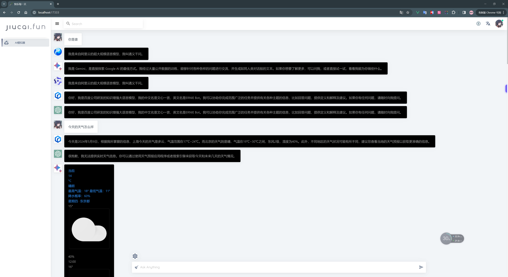

## ai-simulator

本地运行的免费AI模拟器，理论上可以支持所有网页端的AI，目前支持以下AI

- OpenAI
- Google Gemini
- 通义千问
- 混元
- 文心一言

# Attention：本项目仅供学习交流使用，严禁用于任何商业用途

## 一次运行到处白漂



## FAQ

- 为什么需要账号登录
```text
ai模拟器，顾名思义，模拟用户本地操作的一个模拟程序，最终还是用户自己本地电脑的访问操作
```

- 为什么不能用ChatGPT
```text
不提供任何VPN代理服务，完全是一个本地运行的模拟程序
```
